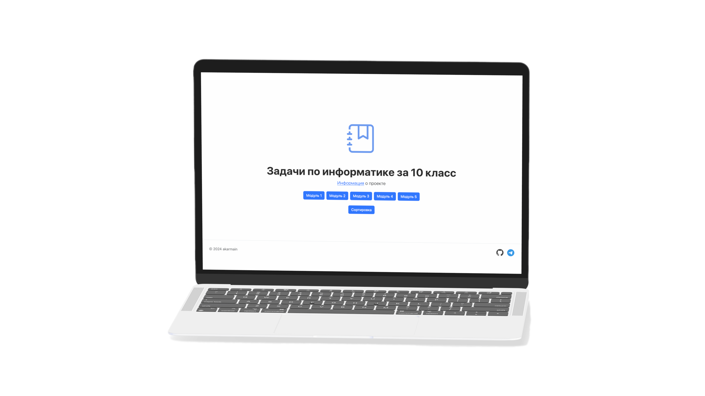

# My school [school.akarmain.ru](https://school.akarmain.ru/)
Это исходники сайта для демонстрации решенных задач по информатике.

[Информация](https://school.akarmain.ru/projects_info/Mini#school_akarmain) о проекте


<hr>

## Локальный запуск

0. Убедитесь, что у вас установлены  [Node.js](https://nodejs.org/) и npm 
1. Клонируйте репозиторий:
```shell
git clone https://github.com/akarmain/my_school
cd my_school
```
2. Установите необходимые зависимости:
```shell
npm install
```
3. Запустите приложение с помощью nodemon:
```shell
npm run dev
```

___
_Спасибо, что читаете мой код!_
